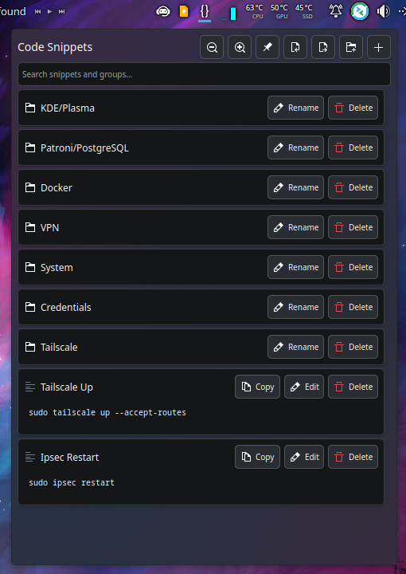
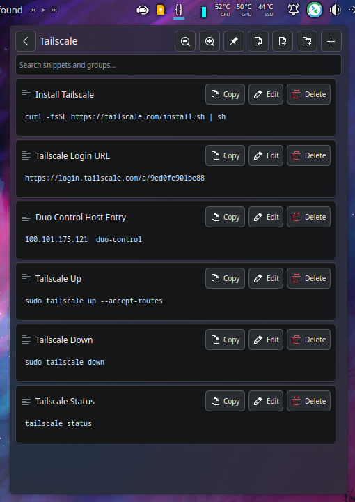

# Code Snippet Holder Plasmoid

A KDE Plasma widget that allows you to store, organize, and quickly copy code snippets (Not just code snippets, but SQL queries, other notes, configs, etc... ) directly from your desktop panel.


## Screenshots

<p align="center">
  
  
</p>

## Features

- **Store Code Snippets**: Save your frequently used code snippets with custom titles
- **Search & Filter**: Quickly find snippets using the built-in search functionality
- **One-Click Copy**: Copy snippets to clipboard with a single click
- **Edit & Delete**: Modify existing snippets or remove ones you no longer need
- **Customizable Font Size**: Adjust font size for better readability with zoom controls
- **Pin Window**: Keep the widget window open while working
- **Persistent Storage**: Snippets are automatically saved in Plasma configuration
- **Import/Export**: Ability to Import or Export your saved snippets as a JSON file.
- **Native Integration**: Seamlessly integrates with KDE Plasma theme

## Installation

### Method 1: KDE Plasma Store

1. Open your KDE desktop and right-click on the panel.
2. Select "Add Widgets...".
3. Search for "Code Snippet Holder" in the widget list.
4. If not found, click "Get New Widgets" and search for "Code Snippet Holder".
5. Install directly from the KDE Plasma Store:
   [Code Snippet Holder on KDE Store](https://www.pling.com/p/2333778/)
6. Add the widget to your panel as usual.

### Method 2: Manual Installation

1. Clone this repository:
   ```bash
   git clone https://github.com/LoneWolf728/Code-Snippet-Holder-Plasmoid.git
   cd Code-Snippet-Holder-Plasmoid
   ```

2. Install the plasmoid:
   ```bash
   kpackagetool6 --install code-snippet-holder/package --type Plasma/Applet
   ```

3. Restart Plasmashell:
   ```bash
   kquitapp6 plasmashell && kstart plasmashell
   ```

4. Add the widget to your panel:
   - Right-click on your panel
   - Select "Add Widgets..."
   - Search for "Code Snippets"
   - Drag it to your panel

## Usage

### Adding Snippets

1. Click the Code Snippets icon in your panel
2. Click the "Add" button
3. Enter a title and your code snippet
4. Click "Save"

### Managing Snippets

- **Search**: Use the search bar to filter snippets by title or content
- **Copy**: Click the "Copy" button to copy code to clipboard
- **Edit**: Click "Edit" to modify existing snippets
- **Delete**: Click "Delete" to remove snippets
- **Font Size**: Use the +/- buttons to adjust text size
- **Pin**: Click the pin button to keep the window open

### Keyboard Shortcuts

- The search field supports standard text navigation
- Use Tab to navigate between interface elements

## Configuration

The widget stores its configuration in the standard Plasma configuration system:

- **Snippets Data**: Stored as JSON in `snippetsData` configuration key
- **Font Size**: Stored in `fontSize` configuration key (range: 6-24)
- **Auto-save**: All changes are automatically persisted

## Technical Details

### Requirements

- KDE Plasma 6.0 or higher
- Qt 6.0 or higher
- QML modules: QtQuick, QtQuick.Layouts, QtQuick.Controls

### Architecture

- **Main Component**: `main.qml` - Core widget logic and UI
- **Configuration**: `main.xml` - Configuration schema
- **Metadata**: `metadata.json` - Widget information and metadata

### File Structure

```
code-snippet-holder/
└── package/
    ├── metadata.json          # Widget metadata and information
    └── contents/
        ├── config/
        │   └── main.xml       # Configuration schema
        └── ui/
            └── main.qml       # Main widget interface
```

## Troubleshooting

### Widget Not Appearing

If the widget doesn't appear after installation:

1. Restart Plasma:
   ```bash
   killall plasmashell
   plasmashell &
   ```

2. Check installation:
   ```bash
   kpackagetool6 --list --type Plasma/Applet | grep codesnippets
   ```

### Removing the Widget

To uninstall:
```bash
kpackagetool6 --remove org.kde.plasma.codesnippets --type Plasma/Applet
```

### Configuration Issues

If snippets aren't being saved:
1. Check Plasma configuration permissions
2. Try removing and re-adding the widget
3. Check system logs for any error messages

## License

This project is licensed under the GPL-2.0+ License - see the [LICENSE](LICENSE) file for details.

## Acknowledgments

- KDE Plasma development team for the excellent framework
- Qt project for the QML framework
- Contributors and users who provide feedback and suggestions

## Changelog

### Version 1.0
- Initial release
- Basic snippet storage and management
- Search and filter functionality
- Copy to clipboard support
- Font size customization
- Pin window feature
- Plasma 6.0 compatibility

---

**Note**: This widget is designed for KDE Plasma 6.0+. For older Plasma versions, you may need to modify the QML imports and API calls accordingly.
